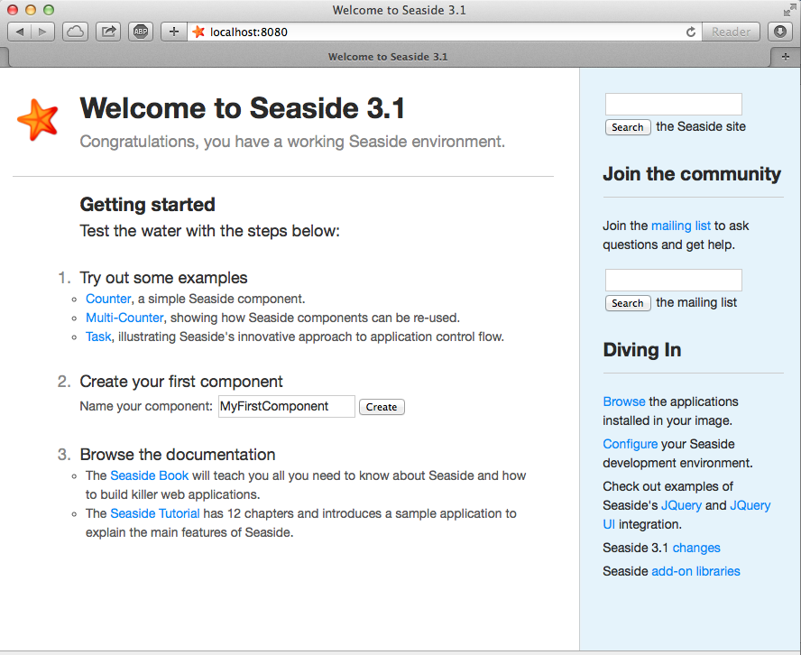
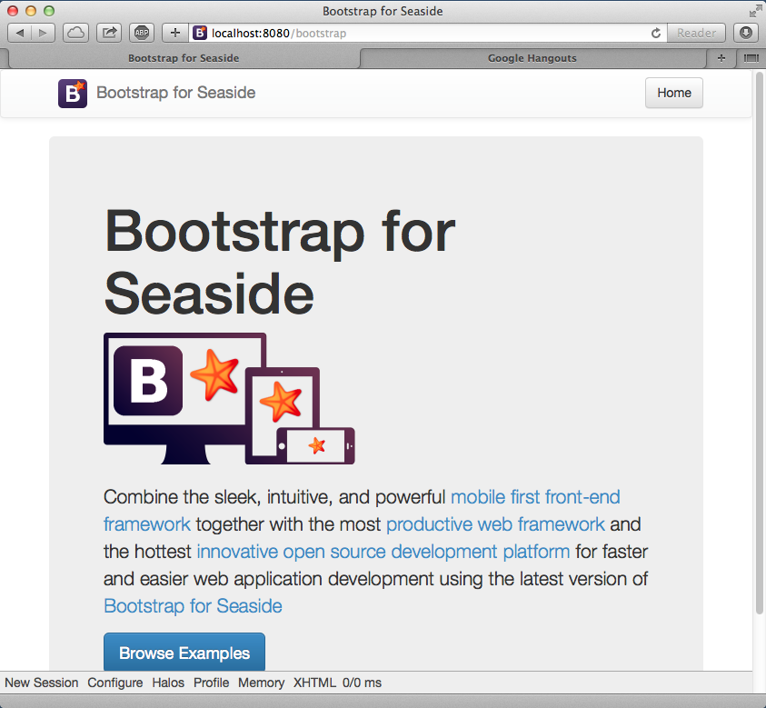
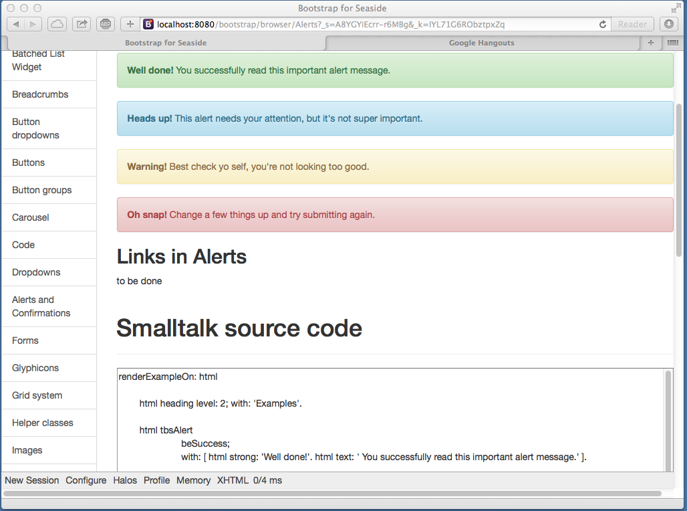
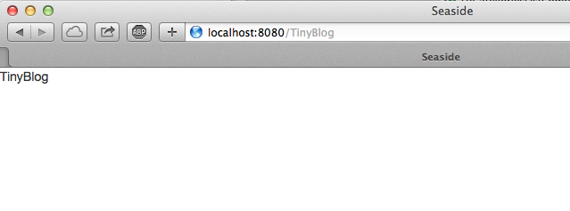

## First Steps with Seaside


In this chapter, we will setup Seaside and build our first Seaside component.
In the next chapters, we will develop the public part of TinyBlog, then the authentication system, followed by the administration part reserved to blog administrators.

All along, we will define Seaside components [http://www.seaside.st](http://www.seaside.st).
A reference book is available online [http://book.seaside.st](http://book.seaside.st) and the first chapters may help you and be a great companion of this tutorial book.

All the following work is independent of Voyage and the Mongo database.
As usual, you can download the code of previous chapters as explained in the last chapter.


### Starting Seaside


Seaside should be already loaded in your PharoWeb image.
If not, please refer to the loading chapter.

There are two ways to start Seaside. The first one consists of( executing the following snippet:


```
ZnZincServerAdaptor startOn: 8080.
```


The second one uses the graphical tool named "Seaside Control Panel" (Tools Menu>Seaside Control Panel).
In the contextual menu (right clic) of this tool, select "add adaptor..." and add a server of type `ZnZincServerAdaptor`, then define the port number (e.g. 8080) it should run on (cf. Figure *@RunningSeaside@*). By opening a web browser on the URL [http://localhost:8080](http://localhost:8080), you should see the Seaside home page as displayed on Figure *@SeasideWebStart@*.



### Bootstrap for Seaside


The Bootstrap library is directly accessible from Pharo and Seaside.
The repository and the documentation of Bootstrap for Pharo is available there:
[https://github.com/astares/Seaside-Bootstrap4](https://github.com/astares/Seaside-Bootstrap4).
But it is already loaded into the PharoWeb image we are using with this book.

You can browse the examples locally in your browser by clicking on the **bootstrap** link in the list of applications hosted by Seaside or directly enter this URL [http://localhost:8080/bootstrap](http://localhost:8080/bootstrap).
You should see Bootstrap examples as shown in Figure *@bootstrap@*.



By clicking on the **Examples** link at the bottom of the page, you can see both Bootstrap graphical elements and the Seaside code needed to obtain them (cf. Figure *@examplebootstrap@*).




### Define our Application Entry Point


Create a class named `TBApplicationRootComponent` which will be the entry point of the application.


```
WAComponent subclass: #TBApplicationRootComponent
   instanceVariableNames: ''
   classVariableNames: ''
   package: 'TinyBlog-Components'
```


We register the TinyBlog application into the Seaside application server by defining the `initialize` class method in the `'initialization'` protocol.
We also integrate dependencies to the Bootstrap framework (CSS and JS files will be embedded in the application).

```
TBApplicationRootComponent class >> initialize
   "self initialize"
   | app |
   app := WAAdmin register: self asApplicationAt: 'TinyBlog'.
   app
      addLibrary: JQDeploymentLibrary;
      addLibrary: JQUiDeploymentLibrary;
      addLibrary: TBSDeploymentLibrary
```


Once declared, you should execute this method with `TBApplicationRootComponent initialize`.
Indeed, class-side `initialize` methods are executed at load time of a class but since the class already exists, we must execute it by hand.

We also add a method named `canBeRoot` to specify that `TBApplicationRootComponent` is not a simple Seaside component but a complete application.
This component will be automatically instantiated when a user connects to the application.

```
TBApplicationRootComponent class >> canBeRoot
   ^ true
```


You can verify that your application is correctly registered into Seaside by connecting to the Seaside server through your web browser, click on "Browse the applications installed in your image" and then see that TinyBlog appears in the list as illustrated in Figure *@BrowseApplications@*. Alternatively, you can visit [http://localhost:8080/TinyBlog](http://localhost:8080/TinyBlog).

### First Simple Rendering


Let's add an instance method named `renderContentOn:` in `rendering`  protocol to make our application display something.

```
TBApplicationRootComponent >> renderContentOn: html
   html text: 'TinyBlog'
```


If you open [http://localhost:8080/TinyBlog](http://localhost:8080/TinyBlog) in your web browser, the page should look like the one on Figure *@EmptyPage@*.



You can customize the web page header and declare it as HTML 5 compliant by redefining the `updateRoot:` method.

```
TBApplicationRootComponent >> updateRoot: anHtmlRoot
   super updateRoot: anHtmlRoot.
   anHtmlRoot beHtml5.
   anHtmlRoot title: 'TinyBlog'
```


The `title:` message is responsible for setting the page title, as can be seen in your web browser's title bar. The `TBApplicationRootComponent` component is the root component of our application.  It will not display a lot of things.
In the following, it will contain and display other components.
For example, a component to display posts to the blog readers, a component to administrate the blog and its posts, ...

### Architecture


We are now ready to define the visual components of our web application.

#### Overview of TinyBlog


Figure *@ComponentOverview@* shows an overview of them and their responsibilities while Figure *@ApplicationArchitecture@* shows the general architecture of our application and the relations between those components.


#### Description of the Main Components


To ease your understanding of the incremental development of this application, Figure *@ApplicationArchitecture@* describes the targeted architecture.


- `ApplicationRootComponent` is the entry point registered into Seaside. This component contains components inheriting from the abstract class `ScreenComponent`.


- `ScreenComponent` is the root of the components used to build the public and administration view of the application. It is composed of a header.


- `PostsListComponent` is the main component that displays the posts. It is composed of instances of `PostComponent`) and manages categories.


- `AdminComponent` is the main component of the administration view. It is composed of a report component (instance of `PostsReport`) built using Magritte.


### Conclusion


We are now ready to start the development of the described components.
In the next chapters, we guide you linearly to develop those components.
If you feel lost at some point, we invite you to come back on this architecture overview to better understand what we are developing.
