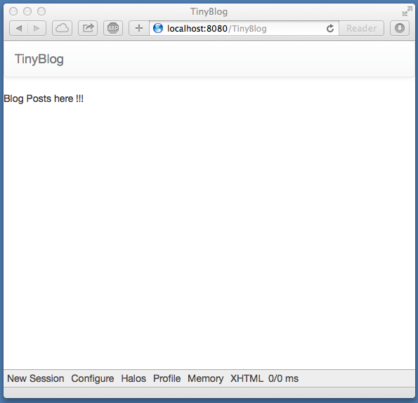
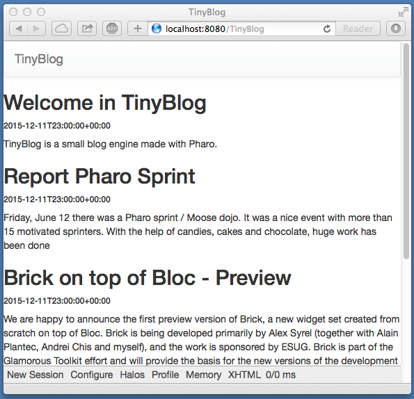

## Web Components for TinyBlog


In this chapter, we build the public view of TinyBlog that displays the posts of the blog. 
Figure *@ApplicationArchitectureUserWithoutCategory@* shows the components we will work on during this chapter. 
If you feel lost at any moment, please refer to it.


Before starting, you can load the code of previous chapters as described in the last chapter of this book.

### Visual Components


Figure *@ComponentOverview@* shows the visual components we will define in this chapter and where they will be displayed.


#### The TBScreenComponent component


All components contained in `TBApplicationRootComponent` will be subclasses of the abstract class `TBScreenComponent`. This class allows us to factorize shared behavior between all our components.

```
WAComponent subclass: #TBScreenComponent
   instanceVariableNames: ''
   classVariableNames: ''
   package: 'TinyBlog-Components'
```


All components need to access the model of our application. Therefore, in the 'accessing' protocol, we add a `blog` method that returns the current instance of `TBBlog` (the singleton).
In the future, if you want to manage multiple blogs, you will modify this method and return the blog object it has been configured with.

```
TBScreenComponent >> blog
   "Return the current blog. In the future, we will ask the
   session to return the blog of the currently logged in user."
   ^ TBBlog current
```


Let's define a method `renderContentOn:` on this new component that temporarily displays a message.
If you refresh your browser, nothing appears because this new component is not displayed at all yet.

```
TBScreenComponent >> renderContentOn: html
   html text: 'Hello from TBScreenComponent'
```


### Using the TBScreenComponent component


In the final architecture, `TBScreenComponent` is an abstract component and should not be used directly.
Nevertheless, we will use it temporarily while developing other components.


Let's add an instance variable `main` in `TBApplicationRootComponent` class. We obtain the situation described in Figure *@compt1@*.

```
WAComponent subclass: #TBApplicationRootComponent
	instanceVariableNames: 'main'
	classVariableNames: ''
	package: 'TinyBlog-Components'
```


We initialize this instance variable in the `initialize` method with a new instance of `TBScreenComponent`. 

```
TBApplicationRootComponent >> initialize
   super initialize.
   main := TBScreenComponent new
```


We make the `TBApplicationRootComponent` to render this sub-component.

```
TBApplicationRootComponent >> renderContentOn: html
   html render: main
```


We do not forget to declare that the object contained in `main` instance variable is a sub-component of `TBApplicationRootComponent` by redefining the `children` method.

```
TBApplicationRootComponent >> children
   ^ { main }
```


Figure *@fig:Hello@* shows the result that you should obtain in your browser.
Currently, there is only the text: `Hello from TBScreenComponent` displayed by the `TBScreenComponent` sub-component.
\(voir figure *@fig:Hello@*\).


### Pattern of Component Definition

We will often use the same following steps:
- first, we define a class and the behavior of a new component;
- then, we reference it from an existing component that uses it;
- and we express the composite/sub-component relationship by redefining the `children` method.


### Populating the Blog


You can inspect the blog object returned by `TBBlog current` and verify that it contains some posts.  
You can also do it simply as: 
```
TBBlog current allBlogPosts size
```


If it does not, execute: 

```
TBBlog createDemoPosts
```


### Definition of TBHeaderComponent


Let's define a component named `TBHeaderComponent` that renders the common header of all pages of TinyBlog.
This component will be inserted on the top of all components such as `TBPostsListComponent`.
We use the pattern described above: define the class of the component, reference it from its enclosing component, and redefine the `children` method.

Here the class definition:

```
WAComponent subclass: #TBHeaderComponent
   instanceVariableNames: ''
   classVariableNames: ''
   package: 'TinyBlog-Components'
```


### Usage of TBHeaderComponent


Remember that `TBScreenComponent` is the (abstract) root of all components in our final architecture.
Therefore, we will introduce our header into `TBScreenComponent` so that all its subclasses will inherit it.
Since, it is not desirable to instantiate the `TBHeaderComponent` each time a component is called, we store the header in an instance variable named `header`.

```
WAComponent subclass: #TBScreenComponent
   instanceVariableNames: 'header'
   classVariableNames: ''
   package: 'TinyBlog-Components'
```


We initialize it in the `initialize` method categorized in the 'initialization' protocol:

```
TBScreenComponent >> initialize
   super initialize.
   header := self createHeaderComponent
```


```
TBScreenComponent >> createHeaderComponent
   ^ TBHeaderComponent new
```


Note that we use a specific method named `createHeaderComponent` to create the instantiate the header component.
Redefining this method makes it possible to completely change the header component that is used. 
We will use that to display a different header component for the administration view.

### Composite-Component Relationship


In Seaside, sub-components of a component must be returned by the composite when sending it the `children` message.
So, we must define that the `TBHeaderComponent` instance is a children of the `TBScreenComponent` component in the Seaside component hierarchy \(and not in the Pharo classes hierarchy\). 
We do so by specializing the method `children`.
In this example, it returns a collection of one element which is the instance of `TBHeaderComponent` referenced by the `header` instance variable.

```
TBScreenComponent >> children
   ^ { header }
```


### Render an header


In the `renderContentOn:` method ('rendering' protocol), we can now display the sub-component (the header):

```
TBScreenComponent >> renderContentOn: html
   html render: header
```


If you refresh your browser, nothing appears because the `TBHeaderComponent` has no rendering.
Let's add a `renderContentOn:` method on it that displays a Bootstrap navigation header:

```
TBHeaderComponent >> renderContentOn: html
	html tbsNavbar beDefault; with: [  
		 html tbsContainer: [ 
			self renderBrandOn: html
	]]
```


```
TBHeaderComponent >> renderBrandOn: html
   html tbsNavbarHeader: [ 
      html tbsNavbarBrand
         url: self application url;
         with: 'TinyBlog' ]
```


Your browser should now display what is shown in Figure *@navBlog@*.
As usual in Bootstrap navigation bar, the link on the title of the application (`tbsNavbarBrand`) enable users to go back to home page of the application.


#### Possible Enhancements


The blog name should be customizable using an instance variable in the `TBBlog` class and the application header component should display this title.

### List of Posts


Let's create a `TBPostsListComponent` inheriting from `TBScreenComponent` to display the list of all posts. 
Remember that we speak about the public access to the blog here and not the administration interface that will be developed later.

```
TBScreenComponent subclass: #TBPostsListComponent
   instanceVariableNames: ''
   classVariableNames: ''
   package: 'TinyBlog-Components'
```


We can now modify `TBApplicationRootComponent`, the main component of the application, so that it displays this new component as shown in figure *@compt2@*. 
To achieve this, we modify its `initialize` method: 

```
TBApplicationRootComponent >> initialize
   super initialize.
   main := TBPostsListComponent new 
```


We add a setter method named `main:` to dynamically change the sub-component to display but by default it is an instance of `TBPostsListComponent`.

```
TBApplicationRootComponent >> main: aComponent
   main := aComponent
```


We now add a temporary `renderContentOn:` method \(in the 'rendering' protocol\) on `TBPostsListComponent` to test during development \(cf. Figure *@elementary@*\). 
In this method, we call the `renderContentOn:` of the super-class which renders the header component.

```
TBPostsListComponent >> renderContentOn: html
   super renderContentOn: html.
   html text: 'Blog Posts here !!!'
```




If you refresh TinyBlog in your browser, you should now see what is shown in Figure *@elementary@*.


### The PostComponent


Now we will define `TBPostComponent` to display the details of a post.
Each post will be graphically displayed by an instance of `TBPostComponent` which will show the post title, its date, and its content as shown in figure *@compt3@*.


```
WAComponent subclass: #TBPostComponent
   instanceVariableNames: 'post'
   classVariableNames: ''
   package: 'TinyBlog-Components'
```


```
TBPostComponent >> initialize
      super initialize.
      post := TBPost new
```


```
TBPostComponent >> title
   ^ post title
```


```
TBPostComponent >> text
   ^ post text
```


```
TBPostComponent >> date
   ^ post date
```


The `renderContentOn:` method defines the HTML rendering of a post.

```
TBPostComponent >> renderContentOn: html
   html heading level: 2; with: self title.
   html heading level: 6; with: self date.
   html text: self text
```


#### About HTML Forms


In a future chapter on the administration view, we will show how to use Magritte to add descriptions to model objects and then use them to automatically generate Seaside components. 
This is powerful and frees developers to manually describe forms in Seaside.

To give you a taste of that, here the equivalent code as above using Magritte: 

```
TBPostComponent >> renderContentOn: html
   "DON'T WRITE THIS YET"
   html render: post asComponent
```

### Display Posts

Before displaying available posts in the database, you should check that your blog contains some posts:

```
TBBlog current allBlogPosts size
```


If it contains no posts, you can recreate some:
```
TBBlog createDemoPosts 
```


Now, we just need to modify the  `TBPostsListComponent >> renderContentOn:` method to display all visible posts in the database: 

```
TBPostsListComponent >> renderContentOn: html
   super renderContentOn: html.
   self blog allVisibleBlogPosts do: [ :p |
      html render: (TBPostComponent new post: p) ]
```


Refresh your web browser and you should get an error.

### Debugging Errors


By default, when an error occurs in a web application, Seaside returns an HTML page with the error message. You can change this message or during development, you can configure Seaside to open a debugger directly in Pharo IDE. To configure Seaside, just execute the following snippet:

```
(WAAdmin defaultDispatcher handlerAt: 'TinyBlog') 
    exceptionHandler: WADebugErrorHandler
```


Now, if you refresh the web page in your browser, a debugger should open on the Pharo side. If you analyze the stack, you should see that we forgot to define the following method:

```
TBPostComponent >> post: aPost
   post := aPost
```


You can define this method in the debugger using the `Create` button. After that, press the `Proceed` button. The web application should now correctly render what is shown in Figure *@better@*.




### Displaying the List of Posts with Bootstrap


Let's use Bootstrap to make the list of posts more beautiful using a Bootstrap container thanks to the message `tbsContainer:`:

```
TBPostsListComponent >> renderContentOn: html
   super renderContentOn: html.
   html tbsContainer: [ 
      self blog allVisibleBlogPosts do: [ :p |
          html render: (TBPostComponent new post: p) ] ]
```


Your web application should look like Figure *@ComponentOverview@*.

### Instantiating Components in `renderContentOn:`


We explained that the `children` method of a component should return its sub-components.
Indeed, before executing the `renderContentOn:` method of a composite, Seaside needs to retrieve all its sub-components and their state.
However, if sub-components are instantiated in the `renderContentOn:` method of the composite (such as in `TBPostsListComponent>>renderContentOn:`), it is not needed that `children` returns those sub-components.

Note that, instantiating sub-components in the rendering method is not a good practice since it increases the loading time of the web page.

If we would store all sub-components that display posts, we should add an instance variable `postComponents`.

```
TBPostsListComponent >> initialize
	super initialize.
	postComponents := OrderedCollection new
```


Initialize it with posts. 

```
TBPostsListComponent >> postComponents 
	postComponents := self readSelectedPosts
			collect: [ :each | TBPostComponent new post: each ].
	^ postComponents 
```


Redefine the `children` method and of course render these sub-components in `renderContentOn:`:

```
TBPostsListComponent >> children 
	^ self postComponents, super children
```


```
TBPostsListComponent >> renderContentOn: html
	super renderContentOn: html.
	html tbsContainer: [ 
		self postComponents do: [ :p |
				html render: p ] ]
```


We do not do this in TinyBlog because it makes the code more complex.

### Conclusion


In this chapter, we developed a Seaside component that renders a list of posts.
In the next chapter, we will improve this by displaying posts' categories.

Notice that we did not care about web requests or the application state.
A Seaside programmer only define components and compose them as we would do in desktop applications.

A Seaside component is responsible for rendering itself by redefining its  `renderContentOn:` method. It should also return its sub-components (if not instantiated during each rendering) by redefining the `children` method.
