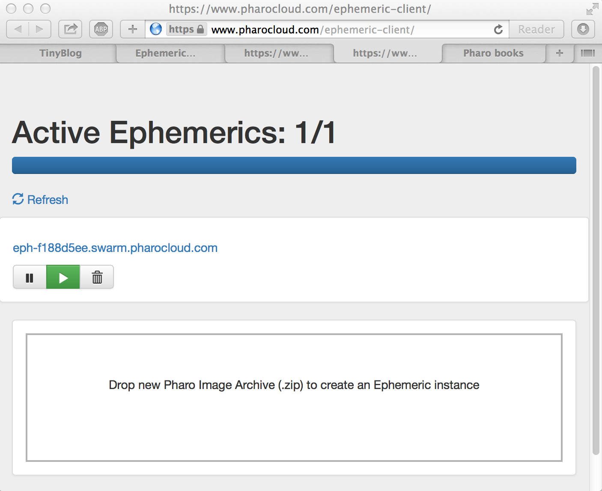
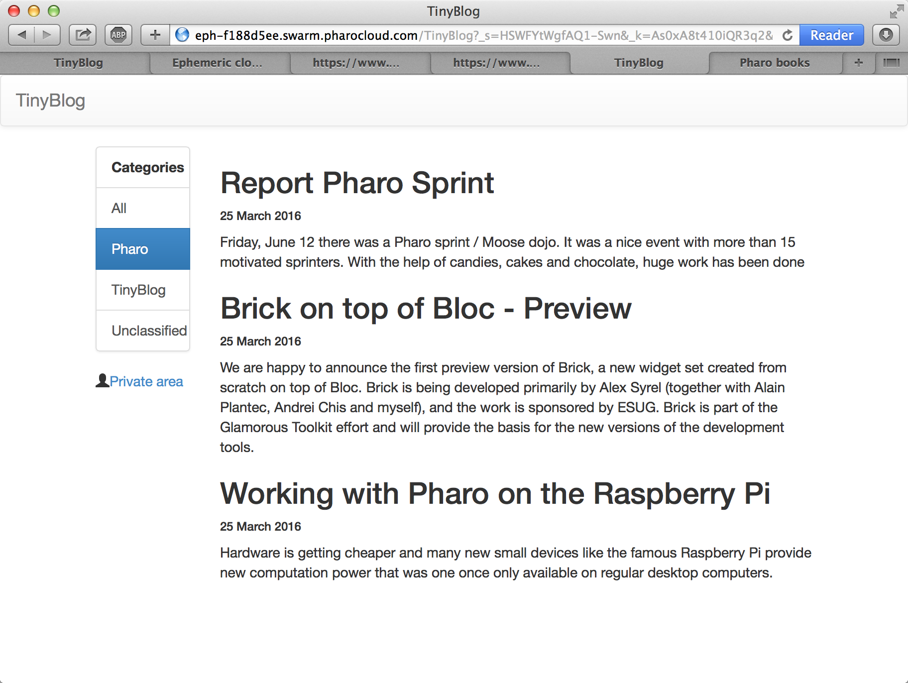

## Deploying TinyBlog


In this chapter, we will show you how to deploy your Pharo application. In particular, we will show how to deploy on the cloud.

### Deploying in the cloud


Now that TinyBlog is ready we will see how we can deploy your application on a server on the web.
If you want to deploy your application on a server that you administrate, we suggest reading the last chapter of
 "Enterprise Pharo: a Web Perspective" ([http://books.pharo.org](http://books.pharo.org)).
In the following, we present a simpler solution offered by PharoCloud.

### Login on PharoCloud

PharoCloud is hosting Pharo applications and it offers the possibility to freely tests its services \(ephemeric cloud subscription\).

Prepare your PharoCloud account:
- Create an account on [http://pharocloud.com](http://pharocloud.com)
- Activate your account
- Connect to this account
- Activate "Ephemeric Cloud" to get an id \(**API User ID**\) and password \(**API Auth Token**\)
- Click on "Open Cloud Client" and log in with the previous IDs
- Once connected, you should get a web page that allows you to upload a zip archive containing a Pharo image and its companion Pharo changes file.


### Preparing your Pharo image Pharo for PharoCloud


#### Get a fresh new image

You should
- First download a fresh PharoWeb image from [http://files.pharo.org/mooc/image/PharoWeb-60.zip](http://files.pharo.org/mooc/image/PharoWeb-60.zip).
- Launch this image and now we will configure it.


#### Seaside configuration

We remove the Seaside demo applications and the development tools

```
"Seaside Deployment configuration"
WAAdmin clearAll.
WAAdmin applicationDefaults removeParent: WADevelopmentConfiguration instance.
WAFileHandler default: WAFileHandler new.
WAFileHandler default
    preferenceAt: #fileHandlerListingClass
    put: WAHtmlFileHandlerListing.
WAAdmin defaultDispatcher
    register: WAFileHandler default
    at: 'files'.
```


#### Loading TinyBlog


We load the latest version of the TinyBlog application.
To load the version we propose you can use :

```
"Load TinyBlog"
Gofer new
   smalltalkhubUser: 'PharoMooc' project: 'TinyBlog';
   package: 'ConfigurationOfTinyBlog';
   load.
#ConfigurationOfTinyBlog asClass loadFinalApp.

"Create Demo posts if needed"
#TBBlog asClass createDemoPosts.
```


You can also load **your **  TinyBlog code from your Smalltalkhub repository.
For example doing:

```
"Load TinyBlog"
Gofer new
   smalltalkhubUser: 'XXXX' project: 'TinyBlog';
   package: 'TinyBlog';
   load.

"Create Demo posts if needed"
#TBBlog asClass createDemoPosts.
```


#### TinyBlog as Default Seaside Application

We now set Tinyblog as the default Seaside application and we run the HTTP webserver:

```
"Tell Seaside to use TinyBlog as default app"
WADispatcher default defaultName: 'TinyBlog'.

"Register TinyBlog on Seaside"
#TBApplicationRootComponent asClass initialize.
```


Lancer Seaside :

```
	"Start HTTP server"
	ZnZincServerAdaptor startOn: 8080.
```


#### Save the Image

Save your image  (Pharo Menu > save) and locally test it in your web browser at: [http://localhost:8080](http://localhost:8080).

### Manually deploying on PharoCloud's Ephemeric Cloud


- Create a zip archive that contains the previously saved images and changes files: `PharoWeb.image` et `PharoWeb.changes`.


- Drag and drop this zip file on the Ephemeric Cloud and activate the image using the play button as shown in Figure *@activeEphemerics@*.




By clicking on the public URL given by PharoCloud you will be able to display your TinyBlog application as shown by Figure *@tinyBlogOnPharoCloud@*.



### Automatic Deployment on PharoCloud's Ephemeric Cloud


Instead of creating a zip archive and using your web browser, the documentation of
 PharoCloud ([http://docs.swarm.pharocloud.com/](http://docs.swarm.pharocloud.com/)) shows how to deploy automatically by executing the following code (it takes some time):

```
|client EPHUSER EPHTOKEN|

Metacello new
	smalltalkhubUser: 'mikefilonov' project: 'EphemericCloudAPI';
	configuration: 'EphemericCloudAPI';
	load.

ephUser :='<REST API UserID>'.
ephToken :='<REST API Token>'.
client := EphemericCloudClient userID: EPHUSER authToken: EPHTOKEN.
	(client publishSelfAs: 'glimpse')
		ifTrue:[ZnZincServerAdaptor startOn: 8080]
		ifFalse: [ client lastPublishedInstance hostname ]
```


### About Dependencies


Good development practices in Pharo are to specify explicitly the dependencies on the used packages.
This ensures the fact that we can reproduce a software artifact.
Such reproducibility supports then the use of an integration server such as Travis or Jenkins.
For this a baseline (a special class) defines the architecture of a project \(dependencies to other projects as well as the structure of your projects).
This is this way that we automatically build the PharoWeb image.
In this book we do not cover this point.
